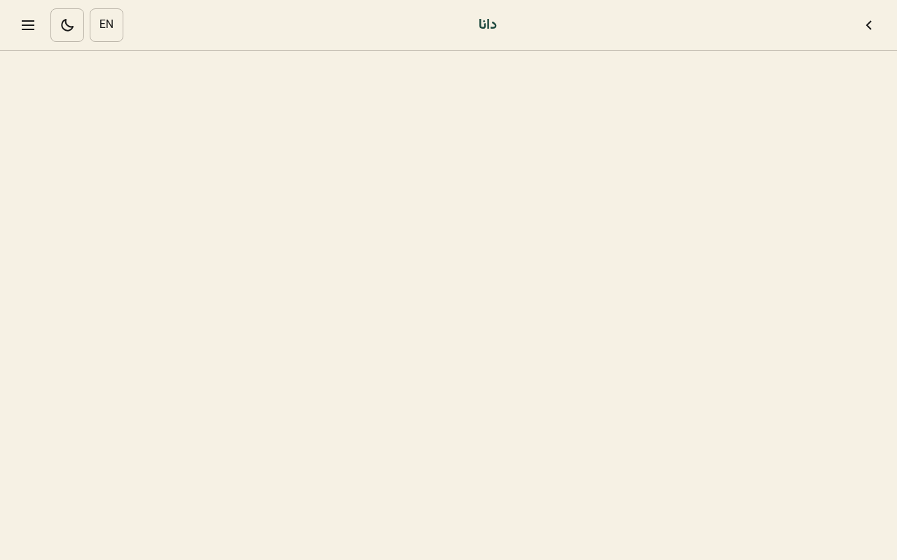
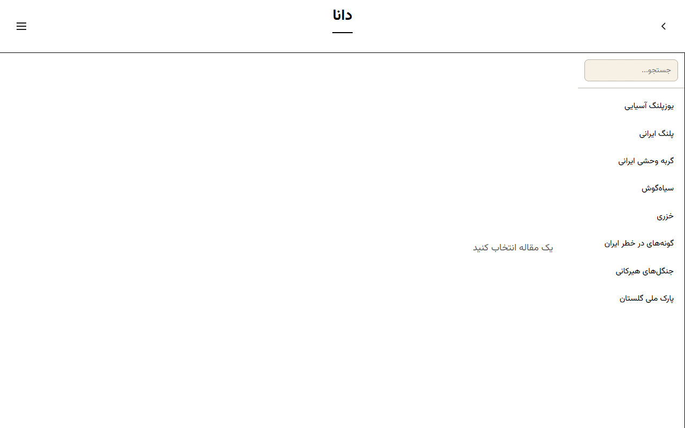

# Dana | دانا

**An Offline 3D Mind Palace for Persian Media Literacy**

> Dana (دانا, "wise") is an offline education-game app for children cut off by Iran's blackout, built as a walkable 3D Mind Palace. Children cross a Chahar Bagh, a Persian courtyard rendered in Three.js with girih tilework and muqarnas detail. Making it light enough for an old $100 Android phone with 2GB RAM.

> Six rooms hold six courses, each one its own interactive game or mission. Along with it, a chatbot with the persona of a  Jester who states confident false claims a child must catch. Everything runs offline after first load: no accounts or servers

> P.s Watch out for which flower falls in the poet's hand after finishing the Zagros Door! 

Status: Alpha prototype, working demo
Offline PWA — live · Android APK — in progress

[](https://github.com/MishaelJulian/dana-hackathon/actions/workflows/codeql.yml)
[](#license)

Live demo:

| | |
|---|---|
|  |  |
| *Chahar Bagh courtyard — Alpha Stage* | *E-ink reading mode — Alpha Stage* |

## Quick start

```bash
cd dana
npm install
npm run dev
# http://localhost:3000
```

Full feature tour: [`docs/FEATURES.md`](docs/FEATURES.md)

## Dev / CLI reference

No CLI — Dana is a client-side web app (Vite + vanilla JavaScript, no framework). Standard scripts, run from `dana/`:

```bash
npm run dev      # dev server
npm run build    # production build
```

See [`dana/README.md`](dana/README.md) for project structure and ZIM/Kiwix setup.

## License

TBD — project is in hackathon phase.
